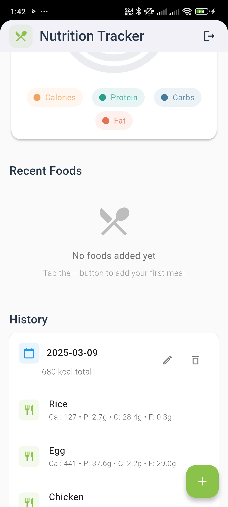
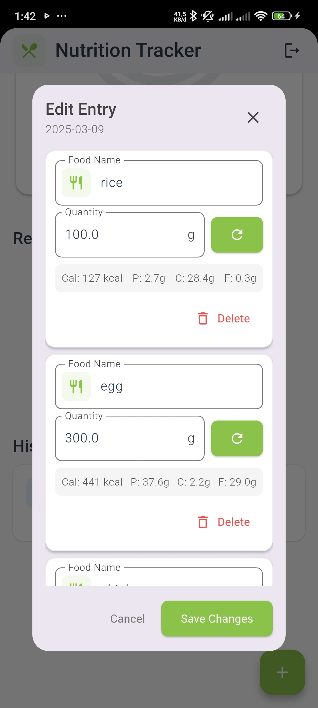

# Nutri App

 |  |  |  |  | 
---|---|---|---|---|---

Aplikasi untuk melacak asupan nutrisi harian dengan fitur pencatatan makanan, perhitungan gizi, dan pemantauan target kesehatan.

## Link video demo singkat
https://youtube.com/shorts/VjX0TZiR7vE?si=U1x53cmQV0VEeXF1

## Deskripsi

Nutri App membantu pengguna untuk:
- 📝 Mencatat makanan yang dikonsumsi setiap hari
- 🧮 Menghitung nilai gizi secara otomatis
- 📈 Memantau kemajuan nutrisi dengan visualisasi grafis
- 🎯 Menetapkan target personal berdasarkan profil pengguna
- 📅 Menyimpan riwayat nutrisi lengkap

## Fitur Utama
- **Autentikasi Pengguna** 🔐
  - Sistem registrasi dan login aman
  - Integrasi Firebase Authentication
- **AI Nutrition Parser** 🤖
  - Analisis input teks natural (contoh: "200gr nasi + 1 potong ayam")
  - Estimasi nutrisi menggunakan model AI
- **Dashboard Interaktif** 📊
  - Progress bar nutrisi real-time
  - Grafik perkembangan mingguan
- **Database Makanan** 🍎
  - 10,000+ entri makanan
  - Pencarian instan dengan autocomplete

## Cara Menggunakan

### Instalasi
1. Clone repository:
```bash
git clone https://github.com/username/nutriapp.git
```

2. Install dependencies:
```bash
flutter pub get
```

3. Tambahkan file konfigurasi Firebase:
```bash
assets/
└── firebase-config.json
```

### Menjalankan Aplikasi
```bash
flutter run --release
```

## Teknologi
- **Frontend**:
  - Flutter 3.13
  - GetX State Management
  - Lottie Animations

- **Backend**:
  - Firebase Firestore
  - Cloud Functions
  - OpenAI Integration

- **Paket Flutter**:
  ```yaml
  dependencies:
    get: ^4.6.6
    firebase_core: ^2.16.0
    syncfusion_flutter_charts: ^23.1.40
    flutter_barcode_scanner: ^3.0.1
  ```

## Struktur Folder
```
lib/
├── app/
│   ├── modules/
│   ├── routes/
│   └── bindings/
├── core/
│   ├── services/
│   └── utils/
├── data/
│   ├── models/
│   └── repositories/
└── widgets/
```
